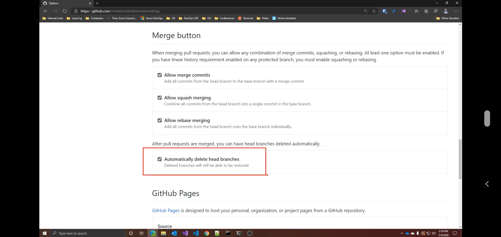

# Fuzzy Finder:-

- It is used to find a file in any git repo which is big in size an we are not able to look after it to use it just go to that repo on github and press **T** and type whatever you wana find.

# OCTPOTREE:-

- To use it it is a extension which can be downloaded for browser and can be use to view the GitHub repo in tree format.

# KeyWords for closing issues:-

- To close issues when we commit we can use keywords as

  - fix #12
  - fixes #12
  - fixed #12
  - close #12
  - closes #12
  - closed #12
  - resolve #12
  - resolves #12
  - resolved #12

    if used in a PR the issue is closed during the merge process

# SuperLinter:-

- Normaly we have a linter to check the syntax during of our code we but when we have multiple programming language associated in our project we should use SUPERLINTER

# Links to code Snipets:-

- This is use to keep the link of the perticular line of the code this is used so that in future if we want to get to perticular line for some reasons such as resolving issue or to understand the functionality.
- for this jus open the file and click to the line to which you want the URL and in browser copy the link and save it wherever you want to keep the snipet click the start lin and hoold shift key and click to the last list of your snipet and this will create a snipet URL in brouser and can be further used for future reference.

# MarkDown Formating :-

1. to make Text appear like a button use the tag <kbd>Hello</kbd> and i=other example is <kbd>Alt</kbd>

2. Visualising Hex Code for this enter Hex code in back-tricks e.g., `#7AC96F`

3. Formating line to do this use

```diff
Now to change the line format use - or plus in Starting of line e.g.,
- This will create a read line
+ This will create a Green Line
```

4. URL MAGICS:-

   - To get the image ot AVATAR of the user or organisation use the code `https://github.com/<Usernmae or orgname>.png`

5. Get diff or patch or PR for a specific commit by URL

- use the URLs as `https://github.com/<owner>/<repo>/commit/<sha>.diff` or `https://github.com/<owner>/<repo>/pull/<ID>.diff` for diff
  Now for patch use URL as `https://github.com/<owner>/<repo>/commit/<sha>.patch` or `https://github.com/<owner>/<repo>/pull/<ID>.patch`s

7. Automatic Branches deletion:-

- Goto the setting of github of your repo and at bottom enable the Automatically delete branches
  

8. If you press Question mark anywhere on github page we get list of shortcuts on screen

# Issues and Guidelines in GitHub:-

1. There is MileStones in github page which behaves as Deadline for issues.
2. We cannot delete an issue.
3. To close the issue type `closes #<issue number>`

# Resolve Conflicts:-

1. If we look at the conflicts of the code we can see somthing like this

```
 <<<<<Contributers Branch name
 line 1
 line 2
 line 3
 line 4
 line 5
 line 6
 ======
line 1
line 2
line 3
line 4
line 5
<<<<<main branch name
```

Now to reasolve there are two code changed one is above the ====== and other at its bottom the code we want can be saved and rest can be deleted and this will resolve the conflict and further can be saved and commit merged and the can be merged the pull request.

### Using Stats for github:-

use Githum readme stats repository of git hub

## Books:-

1. No Degree No Problem.
1. Soft Skills
1. Learn to code get a Job
1. Clean Code
1. The Pragmatic Programmer
1. Cracking the coding Interview
1. indistractable
1. Deep Work
1. Digital minimalism
1. Getting things done
